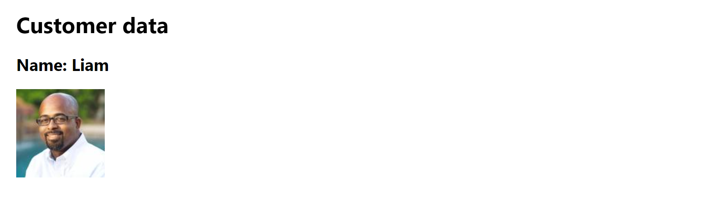

# Customer Data Fetcher

## Overview
The **Customer Data Fetcher** is a simple React application built with JSX as part of the *Advanced React* course on Coursera. The app fetches and displays a single customer's data from the `randomuser.me` API for the fictional Little Lemon Restaurant. It demonstrates data fetching in React using the `fetch` function, handling Promises with `then` methods, and rendering dynamic content based on the fetched data.

## Functionality
The app initially displays a loading state with the text:
- **Heading**: "Data pending..."

Once the data is fetched from the `randomuser.me` API, the app updates to show:
- **Heading**: "Customer data"
- **Subheading**: The customer's first name, e.g., "Name: Ann"
- **Image**: The customer's profile picture from the API

This behavior is achieved using the `useState` hook to store the fetched data and the `useEffect` hook to trigger the `fetchData` function on component mount. The `fetchData` function retrieves a single user's data, and the UI conditionally renders based on whether the data is available.

## Project Structure
- **App.jsx**: The main React component containing the `useState` and `useEffect` hooks, the `fetchData` function, and the JSX for rendering the customer data.
- **index.jsx**: Entry point for the React application (not modified in this lab).

## Screenshot

## Technologies Used
- **React**: For building the user interface.
- **JSX**: For writing the component's UI structure.
- **Fetch API**: For making HTTP requests to the `randomuser.me` API.
- **Create React App**: For the development environment.

## Learning Objectives
This project demonstrates:
- Fetching data from an external API using the `fetch` function.
- Handling asynchronous data with Promises and `then` methods.
- Managing state with the `useState` hook to store fetched data.
- Using the `useEffect` hook to perform side effects on component mount.
- Conditionally rendering UI elements based on state.